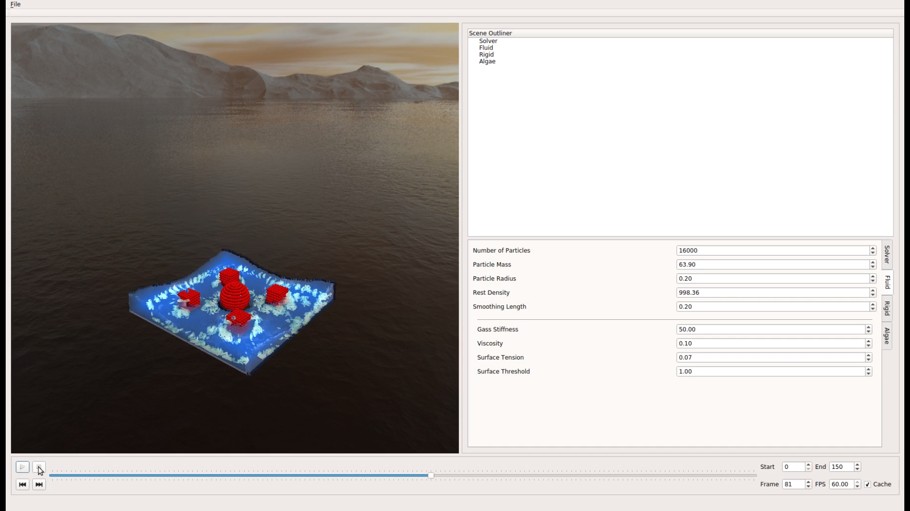
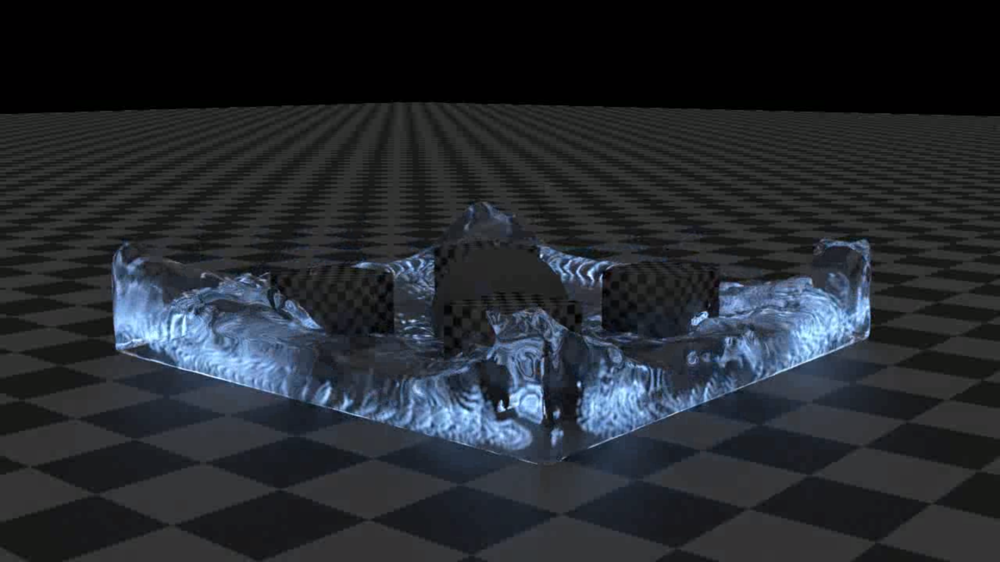

# FluBS (Fluid Bioluminescent Solver)
This is a SPH fluid solver that incorporates a bioluminous model to recreate the effect of bioluminesscent algae in fluid.





## Docs
To build the documentation using Doxygen, run:
```bash
doxygen Doxyfile
```

## Supported Platforms
This project has been tested on the following Platforms

| **OS** | **Version** |
| ---- | ------- |
| Ubuntu | 16.04 |
| RedHat | 7.2 |

Requires an NVIDIA CUDA enabled GPU to utilize parallel optimizations.


## Dependencies
| **Name** | **Version** |
| ---- | ------- |
| [CUDA](https://developer.nvidia.com/cuda-downloads) | >= 7 |
| [GLM](http://glm.g-truc.net/0.9.8/index.html)| >= 0.9.2 (tested 0.9.8) |
| [Eigen](http://eigen.tuxfamily.org/index.php?title=Main_Page)| >= 3.2.9 |
| [ASSIMP](http://www.assimp.org/) | >= 3.3.1 |


## Version
This is version 0.1.0


## Author
Idris Miles

